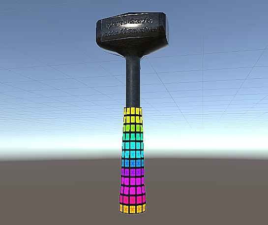
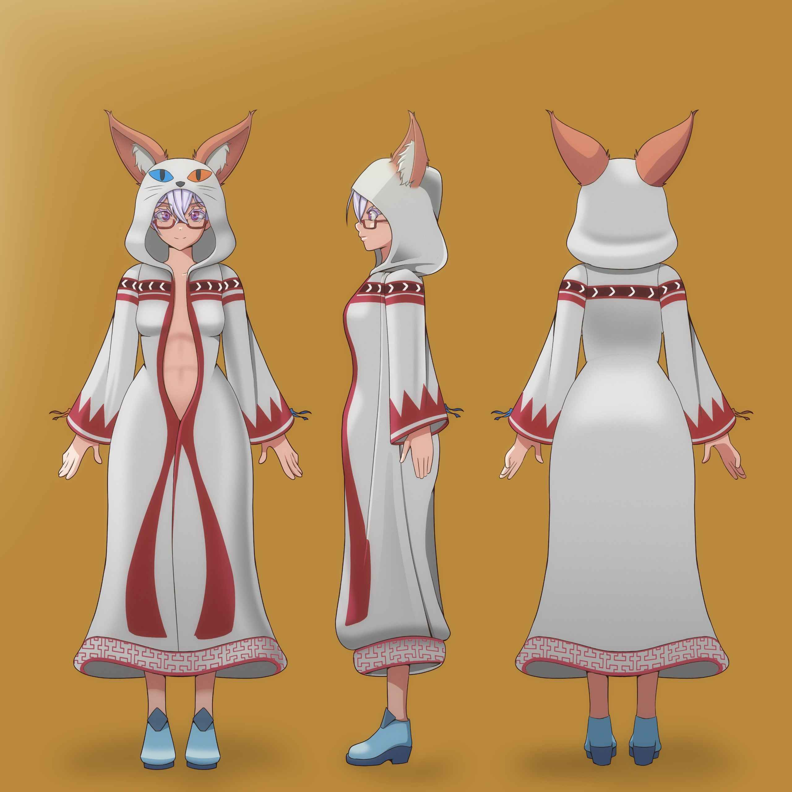
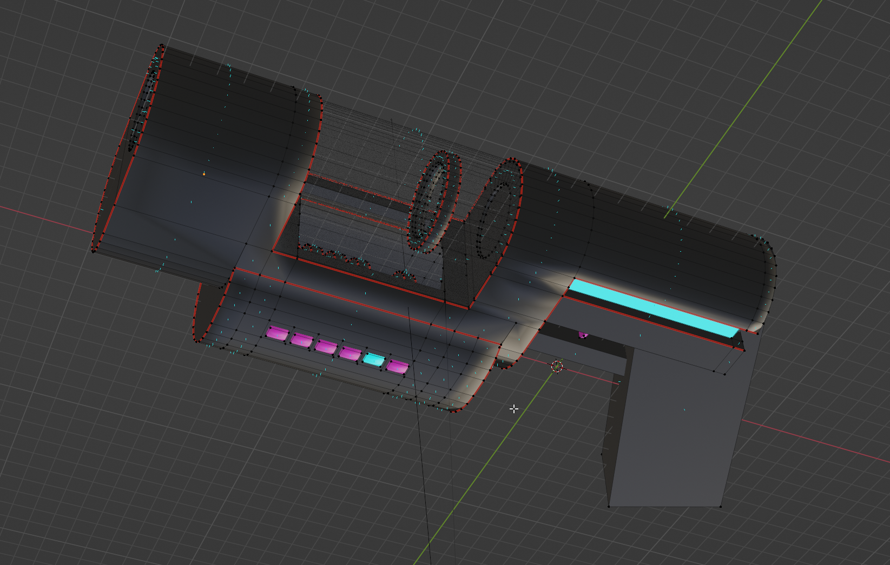

## Official Props

### Precision Adjustment Device (PAD)

The hammer which fixes anything by just hitting it.

https://store.vket.com/en/items/3903

## In Design

### Mage Robe

### Mana Blaster

- "A wizard's best friend is a gun"
- Based on Botania's Mana Blaster but almost more like the Psi aesthetic?

## Future

### Sonic Screwdriver

- The magic wand.
- One of the more wild ideas for the sonic was to have a Japanese paper fan
  fold out of it…
- Probably shouldn't actually call it a sonic screwdriver, but that is more or
  less what it is and how it works so let's maybe call a spade a spade?

### Some kind of scanner?

- Sonic Screwdriver is mostly about making things happen, can I have a screen
  somewhere with various overlays like infrared, heat, ???

### Drones

- At least 3 of the buggers, deployable by just throwing them into the air,
  recoverable by plucking them out of the air much the same.
- Colour scheme is red/white I think, is it white with red lines or red
  with white liners this time?
- Pretty much DJI Mavic Pro with rebranding 
